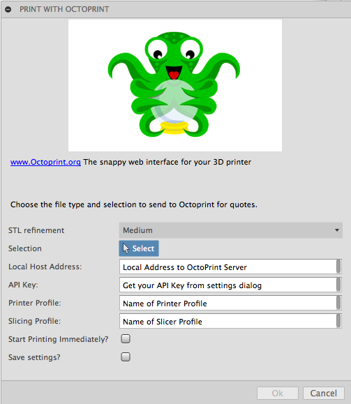

# PrusaFusion
PrusaSlicer Plugin for Fusion 360 over SSH
Easily push Fusion 360 designs to another PC and instantly start slicing!

## Usage:
First see [How to install sample Add-Ins and Scripts](https://rawgit.com/AutodeskFusion360/AutodeskFusion360.github.io/master/Installation.html)

See a youtube video of using the script here:
https://youtu.be/_8f63GZO_oM

Basic usage:
  * Todo

## License
Licensed under the terms of the [MIT License](http://opensource.org/licenses/MIT). Please see the [LICENSE](LICENSE) file for full details.

## Written by

Written by Manuel
Fork from https://github.com/tapnair/OctoFusion, heavily modified.
