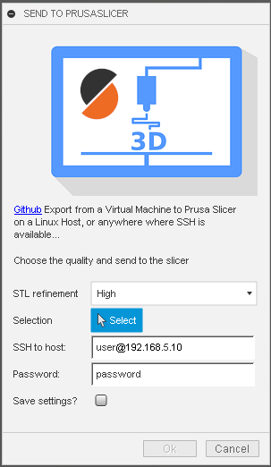

# PrusaFusion
PrusaSlicer Plugin for Fusion 360 over network (SSH)

Easily push Fusion 360 designs to another machine from within Fusion and instantly start slicing!

## Current Platform support:
- Linux

## Info:

Stl are in the tmp directories on both Platforms.

There are two components. The sender aka Fusion plugin and the reciver aka prusafusion_daemon.sh and fusion_helper.sh

## Usage:
First see [How to install sample Add-Ins and Scripts](https://rawgit.com/AutodeskFusion360/AutodeskFusion360.github.io/master/Installation.html)

See a youtube video of using the script here:
- Todo

Basic usage:
  * Install in Windows
  * connect one time with pscp.exe and plink.exe to the host to safe the ssh key in the registry
  * prusafusion_daemon.sh and fusion_helper.sh go to ~.PrusaSlicer
  * Make sure prusafusion_daemon.sh is running from a Linux user.
  * Change PATH Variable in prusafusion_daemon.sh to the correct one for your PrusaSlicer.AppImage

## Not implemented:
- Umlauts and other crazy charachters you can do in Windows
- Some wiered nameing.
- Opening from more that one stl in one instance of Prusaslicer
  
## License
Licensed under the terms of the [MIT License](http://opensource.org/licenses/MIT). Please see the [LICENSE](LICENSE) file for full details.

## Written by

me

Fork from https://github.com/tapnair/OctoFusion, heavily modified.
